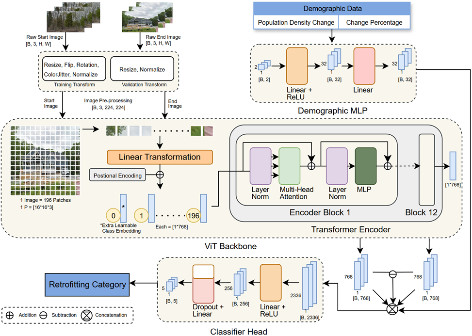

# 🏙️ Multi-Modal Urban Retrofitting Detection

## Background on Urban Retrofitting

With large-scale urban expansion reaching saturation levels in many developed countries (Angel et al., 2020), cities increasingly rely on **urban retrofitting** — localized improvements in pre-existing infrastructures that elevate functionality and sustainability (Dixon et al., 2014).  
These small-scale retrofitting activities include **physical renovations**, **land use adaptations**, and **greening initiatives**, collectively enhancing a city's infrastructure, continuity, and livability.

Global cities have adopted diverse retrofitting strategies to improve urban livability, efficiency, and sustainability through five key approaches (Ma et al., 2025):

1. **Re-inhabitation** — Upgrading housing quality and socioeconomic conditions while promoting diversity.  
2. **Re-building** — Optimizing existing structures for community purposes and increased density.  
3. **Re-transportation** — Establishing interconnected, environmentally sustainable mobility networks.  
4. **Re-capital** — Fostering sustainable socioeconomic development.  
5. **Re-greening** — Incorporating natural environments within city infrastructure to provide environmental and cultural benefits.

---

## 🧠 Architecture Overview

The model leverages a **temporal Vision Transformer (ViT)** architecture combined with **temporal street view images and demographic features** to classify urban retrofitting types at the census block group level. 

---

## 📂 Description of Files

### 🧩 Notebook Files

| Filename | Description |
|-----------|-------------|
| **temporal_vit_arch_spatial_stratified_vali_top2_per_class_weighted_recapital_duplicated.ipynb** | Main program file for the baseline model used in this study. Includes dataset handling, model implementation, validation, visualization of predictions, and spatial distribution of model accuracy across census block groups. |
| **temporal_vit_arch_spatial_stratified_vali_top2_per_class_weighted_recapital_duplicated_no_socio_data.ipynb** | Ablation study removing the **demographic data component** to evaluate its contribution. |
| **temporal_vit_arch_spatial_stratified_vali_top2_per_class_weighted_recapital_duplicated_no_temp_features.ipynb** | Ablation study removing the **temporal image features** component to assess its effect. |
| **utils.ipynb** | Contains helper scripts and utility functions used throughout the study for data preprocessing, metric computation, and visualization. |

---

### 🧱 Model Checkpoints

All model checkpoints are stored inside the **`ViT_Checkpoints/`** folder in the main directory.

| Filename | Description |
|-----------|-------------|
| **temporal_vit_spatial_stratified_vali_top2_per_weighted_class_loss_v21_epoch_30.pth** | Baseline model checkpoint after 30 epochs. |
| **temporal_vit_spatial_stratified_vali_top2_per_weighted_class_loss_no_socio_v21_epoch_30.pth** | Ablated model checkpoint without the demographic data component (30 epochs). |
| **temporal_vit_spatial_stratified_vali_top2_per_weighted_class_loss_no_temp_features_v21_epoch_30.pth** | Ablated model checkpoint without the temporal image features component (30 epochs). |

---

## ⚠️ License and Usage

This repository and all associated materials are the intellectual property of **the authors**.  
The contents are provided **for academic and research reference only**.  
Copying, redistributing, reproducing, or using the files, models, or code in part or in whole **without prior written permission** from the author is strictly prohibited.

---